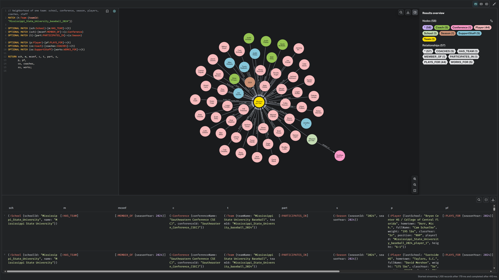
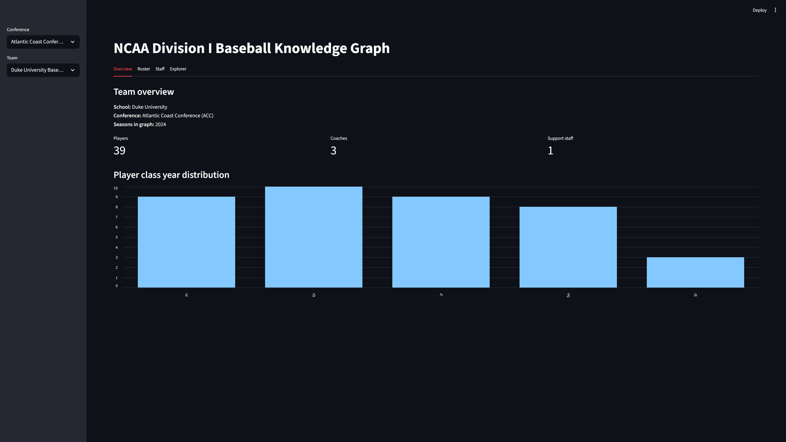
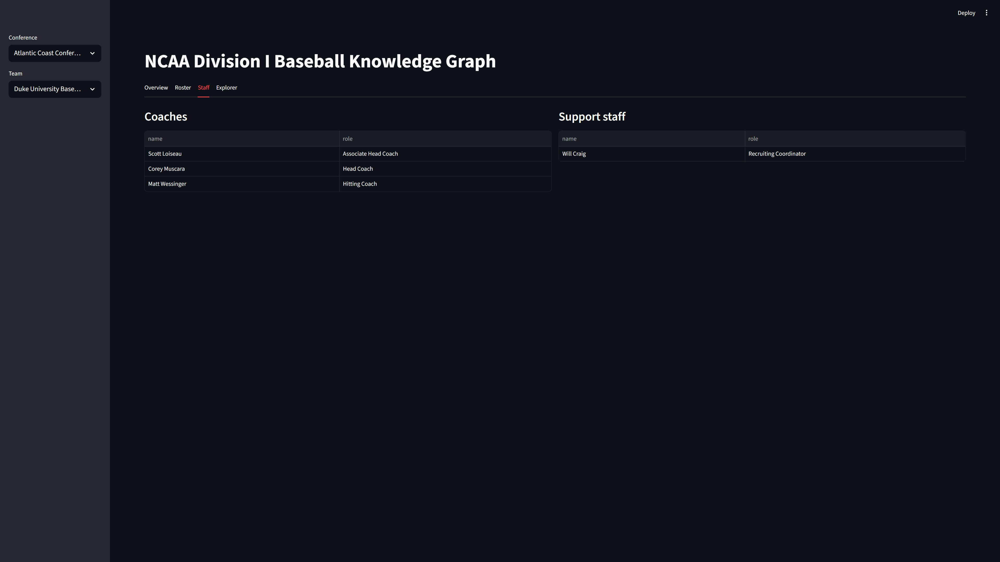

# NCAA Baseball Knowledge Graph: Scraping, Modeling & Streamlit UI


This project consists of three main components:

1. **Data scraping** – automated extraction of rosters and staff data from multiple NCAA Division I baseball programs (Sidearm Sports layouts).
2. **Knowledge graph modeling** – cleaning, normalization, ontology design, and loading all data into Neo4j AuraDB (Cypher + APOC).
3. **Streamlit UI** – an interactive application for browsing teams, rosters, staff, and running sample Cypher queries.

The pipeline takes raw HTML → produces structured JSON → builds a full multi-school knowledge graph → exposes it through a simple web UI.

## Tech stack

- **Python** – scraping, cleaning, JSON generation  
- **Neo4j AuraDB** – graph database and Cypher queries  
- **Cypher** – schema design, querying, and data loading  
- **APOC** – JSON ingestion (`apoc.load.json`)  
- **Streamlit** – interactive UI for browsing the knowledge graph  
- **OWL / Protégé** – initial ontology sketch (conceptual domain model)


## Project Workflow

```text
Step 1: Web Scraping               Step 2: Cleaning & Normalization       Step 3: Neo4j Loading                 Step 4: Streamlit UI
 ┌───────────────────────┐          ┌──────────────────────────────┐       ┌──────────────────────────┐          ┌───────────────────────────┐
 │ Python (requests, bs4)│   --->   │ JSON cleaning + schema map   │ --->  │ Cypher + APOC (MERGE)    │   --->   │ Interactive graph explorer│
 │ HTML roster pages     │          │ consistent ontology across   │       │ load players/teams/staff │          │ team stats, rosters, etc. │
 └───────────────────────┘          │ 8 schools                    │       └──────────────────────────┘          └───────────────────────────┘
                                    └──────────────────────────────┘
```


## Repository structure

```text
final-scrape/
├── scraping/
│   ├── scrape_rosters.py            # scrape roster data for multiple schools
│   ├── scrape_staff.py              # scrape coaching/support staff data
│   └── parse_sidearm_view2_roster.py# helper for Sidearm "view=2" layouts
│
├── cleaning/
│   ├── clean_rosters.py             # normalize roster JSON → *_ontology_clean.json
│   └── clean_staff.py               # normalize staff JSON → *_staff_clean.json
│
├── clean_schools/                   # per-school cleaned roster files
├── clean_staff/                     # per-school cleaned staff files
│
├── app.py                           # Streamlit UI for KG exploration
├── neo4j_config.py                  # Neo4j AuraDB connection
│
├── all_schools_ontology_clean.json  # final cleaned players/teams JSON
├── all_schools_staff_clean.json     # final cleaned staff JSON
└── .gitignore
```

## How to use it

1. Scrape rosters
```bash
python scraping/scrape_rosters.py
```
2. Scrape staff
```bash
python scraping/scrape_staff.py
```
3. Clean and normalize data
```bash
python cleaning/clean_rosters.py
python cleaning/clean_staff.py
```
After these steps, the JSON files:
* `all_schools_ontology_slean.json`
* `all_schools_staff_clean.json`
are ready to be loaded into Neo4j (e.g. with `apoc.load.json` + Cypher merge scripts).

Example Cypher:
```markdown
CALL apoc.load.json("file:///all_schools_ontology_clean.json") YIELD value
MERGE ...
```

## Neo4j Browser

Example Cypher (sample ego-graph around one team):

```cypher
// Neighborhood of one team: school, conference, season, players, coaches, staff
MATCH (t:Team {teamId: "Mississippi_State_University_baseball_2024"})

OPTIONAL MATCH (sch:School)-[m:HAS_TEAM]->(t)
OPTIONAL MATCH (sch)-[mconf:MEMBER_OF]->(c:Conference)
OPTIONAL MATCH (t)-[part:PARTICIPATES_IN]->(s:Season)

OPTIONAL MATCH (p:Player)-[pf:PLAYS_FOR]->(t)
OPTIONAL MATCH (co:Coach)-[coaches:COACHES]->(t)
OPTIONAL MATCH (ss:SupportStaff)-[works:WORKS_FOR]->(t)

RETURN sch, m, mconf, c, t, part, s,
       p, pf,
       co, coaches,
       ss, works;
```

This query pulls a small “ego graph” centered on one team: the team node plus all its players, coaches, and support staff.
You can run the same pattern for any `teamId` in the dataset.



In the screenshot above, Neo4j Browser shows the team in the center, with connected players, coaches, and support staff.
This is the final structure produced by the scraping + cleaning pipeline (rosters + staff → Neo4j KG).

## Streamlit UI

The repository includes a lightweight Streamlit app for browsing the final graph.

Features:
- Conference → Team selection
- Full roster display
- Coaches and support staff tables
- Team summary (player counts, class year distribution)
- A simple Cypher explorer (read-only)

Run the app:

```bash
streamlit run app.py
```

Make sure your `.env` contains the correct Neo4j Aura credentials:
```csharp
NEO4J_URI=bolt://...
NEO4J_USER=...
NEO4J_PASSWORD=...
```

## UI Preview

Below are sample screenshots from the Streamlit interface used for browsing the NCAA Division I baseball knowledge graph.

### Team overview


### Roster view


### Coaches and support staff


### Cypher explorer


## Notes

This repository contains only the scraping, cleaning, and UI components.  
The larger project (queries, modeling, Neo4j build) is documented separately for the course submission.

